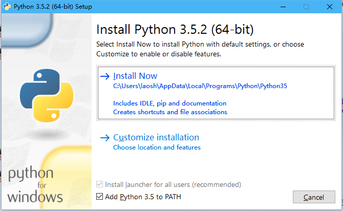
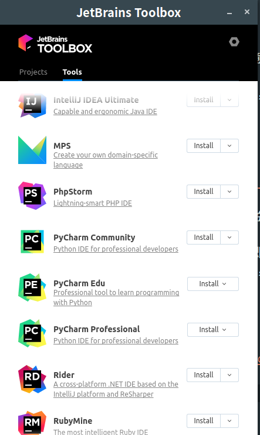

# Quick Start

> 下面以 Windows 系统为例，如果是 Linux 或者 Mac 操作系统，忽略此步骤

## 安装 Python

1. 前往 [Python Downloads](https://www.python.org/downloads/windows/)，下载最新版本的安装包。

> **注意**：请下载 Python3 版本。另外根据自身系统选择合适的安装包，如果是 64 位系统，选择 X86-64 系列安装包。

2. 双击下载的 `exe` 安装文件。在安装时，请参考图例所示:

 ，

选中 `Add Python 3.x to Path` 。

如果没有选择此按钮，也可以自行将 Python 加入到环境变量中。

3. 验证安装，使用 `windows+R` 快捷键，输入 `cmd`，打开 windows 命令行，输入 `python`，如果看到 `python` 交互式命令行，即安装成功

## 安装 Conda

1. 前往 [Conda Downloads](https://www.anaconda.com/download/#windows)，下载 Python 3.x 系列的安装包

> 请根据系统位数下载合适的版本，如果 系统是 32 位的，则选择 32 位的安装包。

2. 双击下载的 `exe` 安装文件，按照指引 `下一步` 即可。**建议采用默认配置**
3. 验证安装，使用 `windows+R` 快捷键，输入 `cmd`，打开 windows 命令行，输入 `conda list`，如果看到 一系列的安装包，即安装成功

## 安装 PyCharm/PyCharm Edu

1. 前往 [Toolbox](https://www.jetbrains.com/toolbox/app) 下载 `Toolbox` 的安装包
2. 双击下载的 `exe` 安装文件，按照指引安装
3. 双击 `Toolbox` 图标，在打开的界面中

选择安装需要安装的 `PyCharm` 版本

> - PyCharm Professional Edition:专业版本 需要购买许可，也可以通过教育邮箱去注册申请免费一年使用，请参考 [JetBrains Student](https://www.jetbrains.com/zh/student/) 注册
>  - PyCharm Community Edition: 社区版本，可以免费使用
>  - PyCharm Edu: 教育版本，可免费使用，需要申请开通

